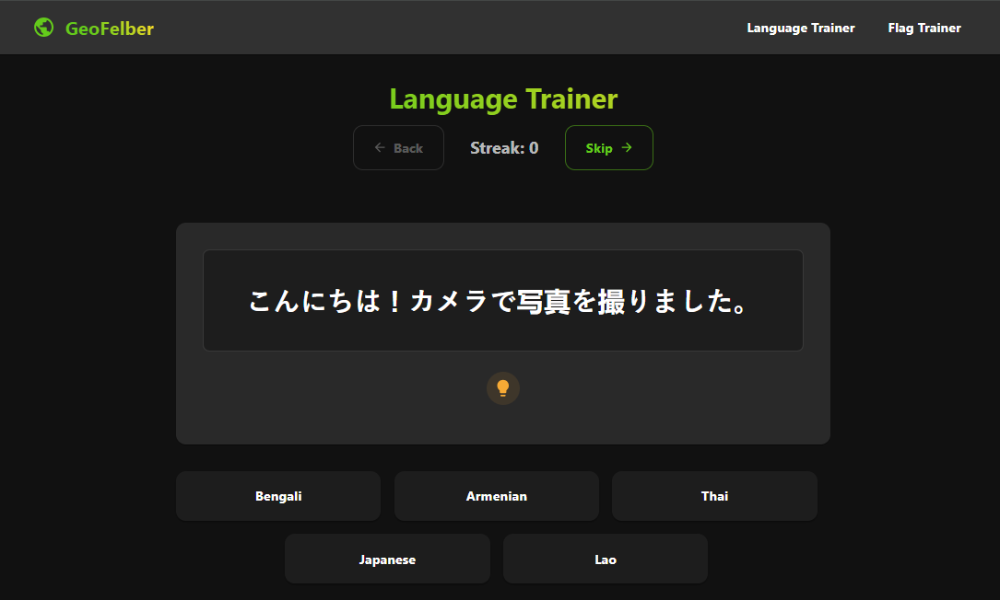

# GeoFelber

A geography learning application that helps users learn about countries through interactive exercises. Currently features a Flag Trainer module that tests users' knowledge of national flags.

## Features

- Flag recognition training
- Interactive quiz format
- Progress tracking with streaks
- Helpful hints for learning
- Back and forward navigation

## Technology Stack

- React
- TypeScript
- Vite
- Material-UI

## Getting Started

1. Clone the repository
2. Install dependencies: `npm install`
3. Run the development server: `npm run dev`
4. Open your browser to the URL shown in the terminal

## Contributing

Contributions are welcome! Please feel free to submit a Pull Request.
